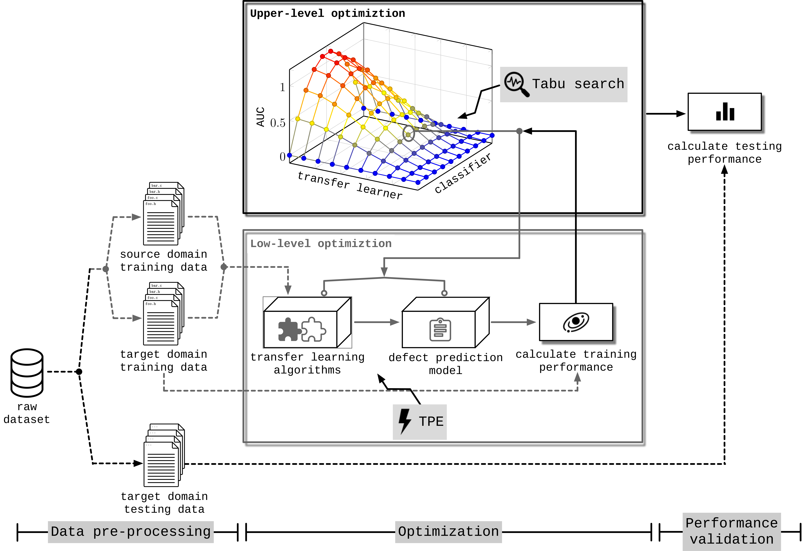

# BiLO-CPDP

> This repository contains materials related to our paper published in ASE 2020

## Introduction

Cross-Project Defect Prediction (CPDP), which borrows data from similar projects by combining a transfer learner with a classifier,have emerged as a promising way to predict software defects when the available data about the target project is insufficient. How-ever, developing such a model is challenge because it is difficult to determine the right combination of transfer learner and classifier along with their optimal hyper-parameter settings.  We propose a tool, BiLO-CPDP, which is the first of its kind to formulate the automated CPDP model discovery from the perspective of bi-level programming.  

## Datasets

- AEEEM
- JURECZKO (12 selected projects)
- ReLink

## Replication

Follow the[ `INSTALL.md`](./INSTALL.md). 

## Contact

If you meet any problems, please feel free to contact us.

- Ke Li (k.li@exeter.ac.uk)
- Zilin Xiang (zilin.xiang@hotmail.com)
